# FemtoRV Physical Implementation: ASIC Flow / Implementación Física de FemtoRV

Este repositorio documenta el proceso completo de diseño, síntesis e implementación física (RTL-to-GDSII) del núcleo **FemtoRV**, un procesador basado en la arquitectura RISC-V. El objetivo de este proyecto es llevar una descripción de hardware (HDL) hasta un layout listo para fabricación. Además, se utiliza **Tiny Tapeout** con el fin de realizar la fabricación del chip.

---

## 1. Processor Architecture / Arquitectura del Procesador (FemtoRV)

El FemtoRV es un núcleo RISC-V diseñado para ser extremadamente ligero y fácil de entender. Antes de iniciar el flujo físico, es crucial entender la microarquitectura que estamos implementando.

El siguiente diagrama de bloques ilustra la organización interna del procesador:

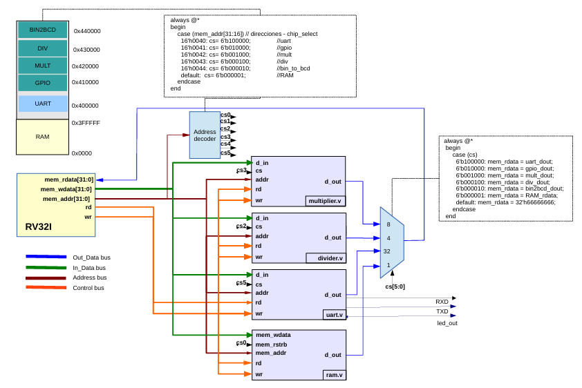
*(Diagrama de bloques de alto nivel para el procesador RV y mapping de registros)*

---

## 2. VLSI Design Flow / Flujo de Diseño VLSI (ASIC Flow)

Para materializar el FemtoRV en silicio, se siguió un flujo de diseño riguroso dividido en dos grandes etapas: **Frontend** (Diseño Lógico) y **Backend** (Diseño Físico).

### 2.1. Logic & Functional Design (Frontend) / Diseño Lógico y Funcional
Esta etapa se centra en la descripción del comportamiento del procesador y su traducción a compuertas lógicas digitales.


*(Reference Diagram 1: Frontend Flow)*

Basado en el diagrama anterior, los pasos ejecutados fueron:

1.  **System Specification & Architectural Design (Especificación):** Definición de requisitos del FemtoRV, es decir, entradas y salidas hacia los periféricos y formas de comunicación con el procesador.
2.  **RTL Description / HDL (Diseño RTL):** Escritura del código en Verilog.
3.  **Functional Verification (Verificación Funcional):** Simulación del RTL para asegurar que el procesador ejecuta las instrucciones correctamente.
4.  **Logic Synthesis (Síntesis Lógica):** Transformación del código RTL a un *Gate Level Netlist*.
5.  **Logic Verification (Verificación Lógica):** Validación del Netlist.

### 2.2. Physical Design (Backend) / Diseño Físico
Una vez obtenidas las compuertas lógicas, el siguiente reto es colocarlas físicamente en el área del chip.

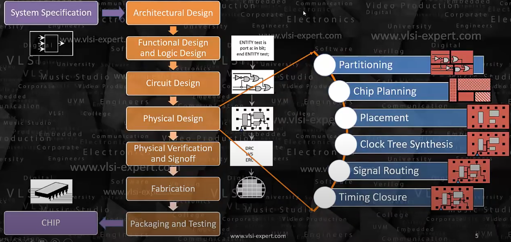
*(Reference Diagram 2: Backend Flow)*

Siguiendo el flujo detallado en la imagen, el proceso consta de:

1.  **Partitioning & Chip Planning (Planificación):** Definición del Floorplan y pines.
2.  **Placement (Colocación):** Ubicación óptima de las celdas estándar.
3.  **Clock Tree Synthesis - CTS (Síntesis del Árbol de Reloj):** Distribución sincronizada del reloj.
4.  **Signal Routing (Enrutado):** Conexión física de todas las celdas.
5.  **Timing Closure (Cierre de Tiempos):** Verificación de *Setup* y *Hold*.
6.  **Physical Verification (Verificación Física):** DRC, LVS y generación de GDSII para fabricación.

---

## 3. Fabrication Platform & Template / Plataforma de Fabricación y Plantilla

Este proyecto fue diseñado específicamente para ser fabricado a través de **Tiny Tapeout**.

### Tiny Tapeout: Quicker, easier and cheaper to make your own chip!

**What is Tiny Tapeout? / ¿Qué es Tiny Tapeout?**
> Tiny Tapeout is an educational project that aims to make it easier and cheaper than ever to get your digital and analog designs manufactured on a real chip.
>
> *Tiny Tapeout es un proyecto educativo que tiene como objetivo hacer que sea más fácil y barato que nunca fabricar tus diseños digitales y analógicos en un chip real.*

To learn more and get started, visit / Para aprender más visita: [tinytapeout.com](https://tinytapeout.com).

### Project Template Usage / Uso de la Plantilla del Proyecto

Para garantizar la integración correcta en el chip compartido, fue **necesario utilizar el template base oficial**. Esto asegura que el diseño cumpla con las restricciones de pines, área y configuración del entorno de Github Actions.

* **Base Template / Plantilla Base:** Tiny Tapeout Verilog Project Template:https://github.com/TinyTapeout/ttsky-verilog-template
* **Project Repository / Repositorio del Proyecto:** `EstebanUnal-Hub/VLSI-UNAL`:https://github.com/EstebanUnal-Hub/FemtoRV_UN
* **Significance / Importancia:** Esta plantilla preconfigura el entorno de **OpenLane** y las definiciones de pines necesarias para el shuttle de fabricación.

---

## 4. Tools & Environment / Herramientas y Entorno

Para replicar este diseño, se requiere un entorno basado en Linux (Ubuntu recomendado). A continuación, se describen las herramientas utilizadas y su función específica dentro del flujo ASIC descrito en la **Sección 2**.

### Tool Description / Descripción de las Herramientas

* **OpenLane (The Orchestrator):** Es la herramienta principal que automatiza todo el flujo **RTL-to-GDSII**. OpenLane conecta y coordina todas las demás herramientas (Yosys, OpenROAD, Magic, etc.) para pasar de la Sección 2.1 a la 2.2 de forma automatizada.
* **Icarus Verilog & GTKWave:** Pertenecen a la etapa de **Functional Verification** (Sección 2.1). Icarus compila y simula el código Verilog del FemtoRV, y GTKWave permite visualizar las ondas para depurar errores.
* **Yosys:** Ejecuta la **Logic Synthesis** (Sección 2.1). Traduce el código Verilog legible por humanos a una lista de compuertas (Netlist) optimizada.
* **OpenSTA:** Crítico para el **Timing Closure** (Sección 2.2). Realiza el análisis estático de tiempo para asegurar que el procesador cumpla con las frecuencias requeridas sin violaciones de *Setup* o *Hold*.
* **Magic VLSI:** Utilizado en la **Physical Verification** (Sección 2.2). Permite visualizar el layout final (.gds) y realizar comprobaciones de reglas de diseño (DRC).
* **Ngspice:** Simulador de circuitos a nivel transistor, útil para validaciones analógicas y caracterización.
* **Xyce:** Simulador de circuitos paralelo de alto rendimiento desarrollado por Sandia National Laboratories, utilizado para simulaciones SPICE post-layout con capacidad de procesamiento paralelo mediante MPI.

---

### Installation Guide / Guía de Instalación

A continuación se detallan los comandos para configurar las herramientas en el entorno de Ubuntu.

#### 1. Yosys
Framework para síntesis Verilog-RTL 

```bash
git clone https://github.com/YosysHQ/yosys.git
cd yosys
sudo apt install make
sudo apt-get install build-essential clang bison flex libreadline-dev gawk tcl-dev libffi-dev git graphviz xdot pkg-config python3 libboost-system-dev libboost-python-dev libboost-filesystem-dev zlib1g-dev
make config-gcc
make
sudo make install
```

#### 2. Icarus Verilog
Compilador Verilog que genera netlists y soporta múltiples estándares.

```bash
sudo apt-get install iverilog
```

#### 3. GTKWave
Visualizador de ondas compatible con VCD.

```bash
sudo apt install gtkwave
```

#### 4. ngspice
Simulador SPICE de código abierto. Simulador para circuitos eléctricos y electrónicos, soporta JFETs, bipolar y transistores MOS, además de elementos pasivos como resistencias, inductores, condensadores, diodos, líneas de transmisión entre otros equipos. Todo se interconecta en un netlist. Los circuitos digitales son simulados desde compuertas a circuitos completos. Y la salida son una o más gráficas de corriente, voltaje, u otras señales eléctricas y pueden ser guardadas en un archivo de datos.

```bash
sudo apt-get install build-essential
sudo apt-get install libxaw7-dev

tar -zxvf ngspice-40.tar.gz
cd ngspice-40
mkdir release
cd release
../configure --with-x --with-readline=yes --disable-debug
make
sudo make install
```

#### 5. OpenSTA
Verificador de timing estático. Puede ser usado para verificar el timing de un diseño por medio de formatos de archivos estándar como verilog netlist, Liberty library, SDC timing constraints, SDF delay annotation y SPEF parasitics.

```bash
sudo apt-get install cmake clang gcc tcl swig bison flex

git clone https://github.com/The-OpenROAD-Project/OpenSTA.git
cd OpenSTA
mkdir build
cd build
cmake ..
make
sudo make install
```

#### 6. Magic
Herramienta de layout. Magic es una herramienta de EDA para diseño físico basado en VLSI desarrollada inicialmente en UC Berkeley.

```bash
sudo apt-get install m4 tcsh csh libx11-dev tcl-dev tk-dev libcairo2-dev mesa-common-dev libglu1-mesa-dev libncurses-dev

git clone https://github.com/RTimothyEdwards/magic
cd magic
./configure
make
sudo make install
```

#### 7. OpenLane & Docker
Flujo RTL-to-GDSII.

```bash
sudo apt-get update
sudo apt-get upgrade
sudo apt install -y build-essential python3 python3-venv python3-pip make git

sudo apt install apt-transport-https ca-certificates curl software-properties-common
curl -fsSL https://download.docker.com/linux/ubuntu/gpg | sudo gpg --dearmor -o /usr/share/keyrings/docker-archive-keyring.gpg
echo "deb [arch=amd64 signed-by=/usr/share/keyrings/docker-archive-keyring.gpg] https://download.docker.com/linux/ubuntu $(lsb_release -cs) stable" | sudo tee /etc/apt/sources.list.d/docker.list > /dev/null

sudo apt update
sudo apt install docker-ce docker-ce-cli containerd.io

sudo groupadd docker
sudo usermod -aG docker $USER
```

Instalación de OpenLane:

```bash
cd $HOME
git clone https://github.com/The-OpenROAD-Project/OpenLane
cd OpenLane
make
make test
```

#### 8. PDKs & Xyce

**8.1. Instalación de Open PDK (SKY130)**

El PDK (Process Design Kit) de SkyWater 130nm es necesario para la implementación física del diseño.

```bash
git clone git://opencircuitdesign.com/open_pdks
cd open_pdks

# Configure the build. A --prefix option can be given to install
# in a different place. By default after installation a 
# /usr/local/share/pdk directory is created if no --prefix is provided.
# Example for custom installation directory:
# ./configure --enable-sky130-pdk --prefix=/home/username/share/pdk

# Do the following steps one at a time and ensure no errors are
# reported after each step.
./configure --enable-sky130-pdk 
make
sudo make install
```

**8.2. Instalación de Xyce**

Xyce es un simulador de circuitos paralelo de alto rendimiento, útil para simulaciones analógicas avanzadas.

```bash
git clone https://github.com/ChipFlow/Xyce-build.git
cd Xyce-build/
./build.sh 
sudo make install prefix=/usr/local
```

**Uso de Xyce:**
```bash
mpirun -np <# procs> Xyce [options] <netlist filename>
```

**Recursos adicionales:**
- RISC-V Python Model: https://pypi.org/project/riscv-model/#files

#### 9. PySpice y herramientas de análisis

**Instalación de dependencias Python para análisis de resultados SPICE:**

```bash
pip3 install ltspice matplotlib numpy scipy
```

---

## 5. Implementation & Practical Flow / Implementación y Flujo Práctico

Esta sección describe el flujo práctico de implementación del FemtoRV siguiendo el **ASIC Flow** descrito en la Sección 2. El proceso comienza con la verificación funcional del diseño RTL mediante simulación.

### 5.1. Estructura del Proyecto

El repositorio contiene la carpeta principal `femtoRV_ASIC_Flow/`, organizada de la siguiente manera:

```
femtoRV_ASIC_Flow/
├── sim/                      # Directorio de simulación
│   ├── cores/                # Modelos de simulación
│   │   ├── sim_spi_flash/    # Modelo de memoria flash SPI
│   │   └── sim_spi_ram/      # Modelo de memoria RAM SPI
│   ├── src/                  # Código fuente RTL
│   │   ├── femto.v           # Top level del diseño
│   │   ├── femtorv32_quark.v # Core RISC-V
│   │   ├── perip_uart.v      # Periférico UART
│   │   ├── uart.v            # Módulo UART
│   │   ├── MappedSPIFlash.v  # Interfaz SPI Flash
│   │   ├── MappedSPIRAM.v    # Interfaz SPI RAM
│   │   └── proyect.v         # Interfaz SPI RAM
│   ├── tt_um_femto_TB.v      # Testbench principal
│   ├── firmware.hex          # Firmware compilado
│   └── tt_um_femto_sim_verilog_2.gtkw  # Configuración GTKWave
├── firmware/                 # Directorio de firmware
│   └── asm/                  # Código ensamblador y C
└── spice/                    # Directorio de simulación SPICE
    ├── tim_to_pwl.py         # Script conversión TIM → PWL
    ├── plot_femto.py         # Script visualización resultados
    ├── Makefile              # Automatización simulación Xyce
    └── femto.cir             # Testbench SPICE generado
```

### 5.2. Functional Verification (Paso 3 del Frontend)

Esta etapa corresponde al **paso 3** del flujo Frontend descrito en la Sección 2.1: **Verificación Funcional**. El objetivo es simular el RTL para asegurar que el procesador ejecuta las instrucciones correctamente.

#### 5.2.1. Generación del Firmware

Antes de simular el procesador, es necesario generar el **firmware** que será ejecutado por el FemtoRV. Este firmware se compila en formato `.hex` para ser cargado en la memoria del procesador.

**Ubicación:** `femtoRV_ASIC_Flow/firmware/asm/`

**Componentes del Firmware:**
- `calculator.c` - Programa principal (calculadora)
- `bin_to_bcd.c`, `mult.c`, `div.c` - Operaciones matemáticas
- `putchar.c`, `getchar.c` - Funciones de I/O UART
- `wait.c` - Funciones de temporización
- `bram.ld` - Linker script para mapa de memoria

**Toolchain Requerido:**
```bash
# Toolchain RISC-V de 32 bits
export PATH="/opt/riscv32/bin:$PATH"

# Verificar instalación
command -v riscv32-unknown-elf-ld
riscv32-unknown-elf-ld --version
```

**Proceso de Compilación:**

El Makefile automatiza la compilación cruzada del firmware:

```makefile
# Variables del toolchain
CROSS   = riscv32-unknown-elf
CC      = $(CROSS)-gcc
AS      = $(CROSS)-as
LD      = $(CROSS)-ld
OBJCOPY = $(CROSS)-objcopy
AFLAGS  = -march=rv32i -mabi=ilp32
```

**Comandos de compilación:**

```bash
cd femtoRV_ASIC_Flow/firmware/asm/

# Compilar todos los archivos .c y .S
make

# Esto genera:
# - firmware.elf      (ejecutable linkado)
# - firmware.bin      (binario)
# - firmware.hex      (formato hexadecimal para simulación)
# - firmware_flash.hex (formato para flash)
# - firmware.lst      (listado ensamblador)
# - firmware.map      (mapa de memoria)
```

El archivo `firmware.hex` es copiado automáticamente al directorio `sim/` para ser usado en la simulación.

**Notas importantes:**
- El linker script `bram.ld` define el mapa de memoria del procesador
- Se utiliza la herramienta `firmware_words` para convertir el ELF a formato hex compatible
- La compilación usa `-march=rv32i` (arquitectura RISC-V de 32 bits, set de instrucciones base)
- Memoria RAM configurada: 16384 bytes (16 KB)

#### 5.2.2. Simulación con Icarus Verilog

Una vez generado el firmware, se procede con la simulación RTL usando **Icarus Verilog** (iverilog) y **GTKWave**.

**Ubicación:** `femtoRV_ASIC_Flow/sim/`

**Archivos de Simulación:**

| Archivo | Descripción |
|---------|-------------|
| `tt_um_femto_TB.v` | Testbench principal que instancia el diseño completo |
| `firmware.hex` | Firmware compilado para ejecución |
| `tt_um_femto_sim_verilog_2.gtkw` | Configuración de visualización de ondas |


**Proceso de Simulación:**

El Makefile automatiza el proceso completo:

```bash
cd femtoRV_ASIC_Flow/sim/

# Ejecutar simulación completa
make sim
```

**Detalles del proceso:**

```makefile
# 1. Limpiar archivos previos
rm -f a.out *.vcd

# 2. Compilar con iverilog
iverilog -DBENCH -DSIM -DPASSTHROUGH_PLL \
         -DBOARD_FREQ=27 -DCPU_FREQ=27 \
         tt_um_femto_TB.v ${OBJS} ${SIM_OBJS}

# 3. Ejecutar simulación con vvp
vvp a.out

# 4. Visualizar resultados con GTKWave
gtkwave tt_um_femto_TB.vcd
```

**Macros de Compilación:**
- `-DBENCH`: Habilita modo banco de pruebas
- `-DSIM`: Activa características específicas de simulación
- `-DPASSTHROUGH_PLL`: PLL en modo bypass
- `-DBOARD_FREQ=27`: Frecuencia del board de 27 MHz
- `-DCPU_FREQ=27`: Frecuencia de CPU de 27 MHz

**Archivos RTL Incluidos:**
```makefile
OBJS = src/femto.v              # Top level
OBJS+= src/femtorv32_quark.v    # Core RISC-V
OBJS+= src/perip_uart.v         # Periférico UART
OBJS+= src/uart.v               # Controlador UART
OBJS+= src/MappedSPIFlash.v     # Interfaz Flash
OBJS+= src/MappedSPIRAM.v       # Interfaz RAM

SIM_OBJS = cores/sim_spi_flash/spiflash.v  # Modelo Flash
SIM_OBJS+= cores/sim_spi_ram/spiram.v      # Modelo RAM
```

#### 5.2.3. Visualización y Análisis con GTKWave

GTKWave permite visualizar las señales de simulación y verificar el comportamiento del procesador.

**Cargar configuración guardada:**
```bash
gtkwave tt_um_femto_TB.vcd tt_um_femto_sim_verilog_2.gtkw
```

El archivo `.gtkw` contiene una configuración previa con las señales más relevantes organizadas:
- Señales de reloj y reset
- Bus de instrucciones y datos
- Señales UART (TX/RX)
- Interfaces SPI (Flash y RAM)
- Estado interno del procesador

**Verificación durante la simulación:**

Durante la simulación se debe verificar:
1. ✅ El procesador inicia correctamente tras el reset
2. ✅ Las instrucciones se fetch desde la memoria correctamente
3. ✅ La ALU ejecuta operaciones matemáticas
4. ✅ La UART transmite y recibe datos
5. ✅ Los accesos a memoria SPI funcionan correctamente
6. ✅ El firmware se ejecuta sin bloqueos

**Captura de simulación GTKWave:**

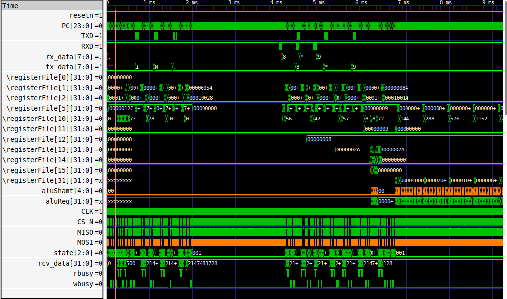
*Simulación funcional del procesador FemtoRV ejecutando el firmware de calculadora. Se observan las señales de reloj, contador de programa, y comunicación UART.*

#### 5.2.4. Exportación de Señales para Simulación Post-Layout

Una vez verificado el comportamiento funcional del diseño, es necesario exportar las señales de interés desde GTKWave para su posterior uso en simulaciones SPICE post-layout.

**Exportar señales a formato TIM:**

Desde GTKWave, seleccionar las señales relevantes (clk, reset, señales de entrada/salida) y exportarlas:

```
File → Export → Write TIM File  As 
```

Esto genera un archivo de texto con los valores de las señales en función del tiempo, compatible para conversión a formato PWL (Piecewise Linear) utilizado en SPICE.

---

### 5.3. Logic Synthesis con OpenLane (Paso 4 del Frontend)

Una vez completada la verificación funcional, el siguiente paso es sintetizar el diseño RTL a un netlist de compuertas utilizando **OpenLane**.

#### 5.3.1. Preparación del Entorno OpenLane

**Dar permisos a la carpeta del PDK:**

```bash
sudo chown -R $USER:$USER /home/linux/.volare
```

**Iniciar OpenLane:**

```bash
cd ~/OpenLane
make pdk
make mount
```

#### 5.3.2. Configuración del Diseño FemtoRV

**Crear estructura de diseño:**

```bash
# Dentro del contenedor de OpenLane
./flow.tcl -design femto -init_design_config -add_to_designs
```

Esto crea la estructura:
```
OpenLane/designs/femto/
├── src/              # Copiar aquí los archivos .v del diseño
└── config.json       # Archivo de configuración
```

**Copiar archivos fuente:**

```bash
cp femtoRV_ASIC_Flow/sim/src/*.v ~/OpenLane/designs/femto/src/
```

#### 5.3.3. Configuración de Parámetros de Síntesis

Editar el archivo `config.json` dentro de `~/OpenLane/designs/femto/`:

```json
{
    "DESIGN_NAME": "femto",
    "VERILOG_FILES": "dir::src/*.v",
    "CLOCK_PORT": "clk",
    "CLOCK_PERIOD": 30.0,
    "DESIGN_IS_CORE": true,
    "PL_RESIZER_HOLD_FIX": 1,
    "PL_RESIZER_TIMING_OPTIMIZATIONS": 1,
    "CTS_HOLD_FIX": 1,
    "FP_PDN_VOFFSET": 20,
    "FP_PDN_HOFFSET": 20,
    "FP_TAPCELL_DIST": 13
}
```

**Parámetros clave:**
- `CLOCK_PERIOD: 30.0` → Período de reloj de 30 ns (33.3 MHz). **Ajustar si hay errores de timing.**
- `DESIGN_IS_CORE: true` → Indica que es un diseño de núcleo completo
- `PL_RESIZER_*` → Optimizaciones de timing durante placement
- `FP_PDN_*` → Offsets para la red de distribución de potencia

#### 5.3.4. Ejecución del Flujo RTL-to-GDSII

**Ejecutar flujo completo:**

```bash
./flow.tcl -design femto -tag full_guide -overwrite
```

Este comando ejecuta automáticamente:
1. ✅ **Synthesis** (Yosys) - Conversión RTL a netlist
2. ✅ **Floorplanning** - Definición del área del chip
3. ✅ **Placement** - Colocación de celdas estándar
4. ✅ **CTS** - Síntesis del árbol de reloj
5. ✅ **Routing** - Enrutado de señales
6. ✅ **Verification** - DRC, LVS, antenna checks
7. ✅ **GDSII Generation** - Layout final

**Resultados generados:**

```
~/OpenLane/designs/femto/runs/full_guide/results/
├── final/
│   ├── gds/
│   │   └── femto.gds          # Layout GDSII
│   ├── mag/
│   │   └── femto.mag          # Layout en formato Magic
│   ├── def/
│   │   └── femto.def          # Design Exchange Format
│   └── lef/
│       └── femto.lef          # Library Exchange Format
└── ...
```

---

### 5.4. Post-Layout Extraction con Magic (Paso 6 del Backend)

Una vez generado el layout físico (.mag), es necesario extraer el netlist SPICE con parásitos (capacitancias, resistencias) para realizar simulaciones realistas post-layout.

#### 5.4.1. Preparar Archivos Magic

**Navegar al directorio de resultados:**

```bash
cd ~/OpenLane/designs/femto/runs/full_guide/results/final/mag
```

**Corregir rutas del PDK en archivos .mag:**

Los archivos `.mag` generados por OpenLane contienen variables `$PDKPATH` que deben reemplazarse por la ruta real:

```bash
sed -i 's|\$PDKPATH|/home/linux/.volare/sky130A|g' *.mag
```

#### 5.4.2. Visualización del Layout en Magic

**Abrir el layout:**

```bash
magic -T /home/linux/.volare/sky130A/libs.tech/magic/sky130A.tech femto.mag
```

**Visualización del chip FemtoRV:**

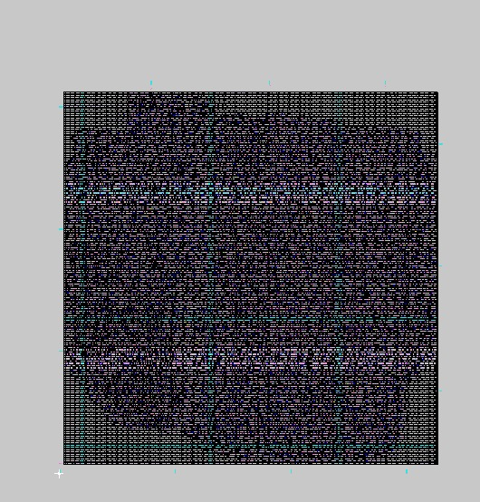
*Layout físico del procesador FemtoRV generado con OpenLane. Se observan las celdas estándar, interconexiones y estructura del chip.*


#### 5.4.3. Extracción de Parásitos

Dentro de la consola de Magic:

```tcl
# Extraer el circuito desde el layout
extract all

# Convertir la extracción a modelo SPICE
ext2spice cthresh 0 rthresh 0
ext2spice
```

**Archivos generados:**
- `femto.ext` - Archivo de extracción intermedio
- `femto.spice` - Netlist SPICE con parásitos RLC

A continuacion puede ver la imagen con los archivos intermedios generados
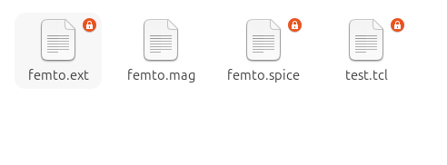
*Se visualizar el contador de programa en entero y se puede ver los cambios que tiene el transcurso del tiempo.*

El archivo `femto.spice` contiene:
- Subcircuitos de todas las celdas estándar
- Capacitancias parásitas entre nodos
- Resistencias de interconexión
- Modelos de transistores del PDK

---

### 5.5. Flujo Alternativo: Tiny Tapeout GitHub Actions

Para proyectos que utilizan la plataforma Tiny Tapeout, el flujo de síntesis y verificación se puede ejecutar automáticamente mediante GitHub Actions.

#### 5.5.1. Configuración del Repositorio

Al hacer push al repositorio del template de Tiny Tapeout, GitHub Actions ejecuta automáticamente:
- Verificación de sintaxis
- Síntesis con OpenLane
- Generación de GDSII
- Verificación DRC/LVS

#### 5.5.2. Descarga de Artefactos

Una vez completado el workflow:

1. Ir a la pestaña **Actions** en GitHub
2. Seleccionar el run exitoso
3. Descargar el artefacto `tt_submission`

**Contenido de `tt_submission`:**
```
tt_submission/
├── tt_um_femto.gds          # Layout final
├── femttt_um_femto.lef          # Abstract view
└── reports/           # Reportes de timing, área, etc.
```

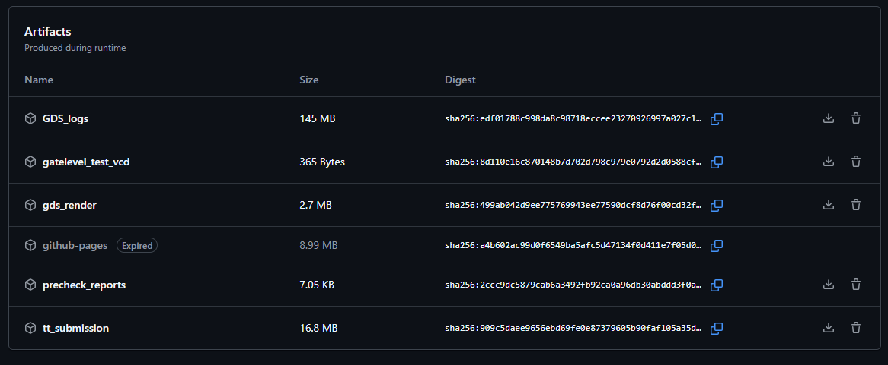
*Artefactos generados por GitHub Actions tras ejecutar el flujo OpenLane en Tiny Tapeout.*

#### 5.5.3. Extracción SPICE desde GDS

El archivo `.gds` descargado también puede ser procesado con Magic para extracción SPICE:

```bash
# Cargar el GDS en Magic
magic -T /home/linux/.volare/sky130A/libs.tech/magic/sky130A.tech femto.gds

# Dentro de Magic:
extract all
# Luego de tener el archivo .ext
ext2spice lvs
ext2spice cthresh infinite
ext2spice rthresh infinite
ext2spice subcircuits off
ext2spice hierarchy off
ext2spice scale off
ext2spice

```

Esto genera un netlist SPICE equivalente al del flujo local, pero basado directamente en el GDSII de fabricación.

A su vez tambien podemo visualizar el chip completo de tt_um_femto:

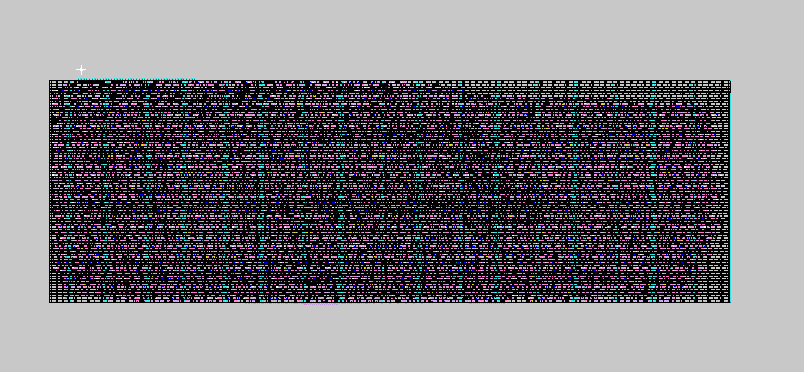
*Layout físico del procesador FemtoRV generado con Tiny TypeOut. Se observan las celdas estándar, interconexiones y estructura del chip.*

Adicionalmente se pude utilziar la herramienta de viewer gds, del siguiente link: 
https://gds-viewer.tinytapeout.com/

Se obtiene la visualizacion del chip

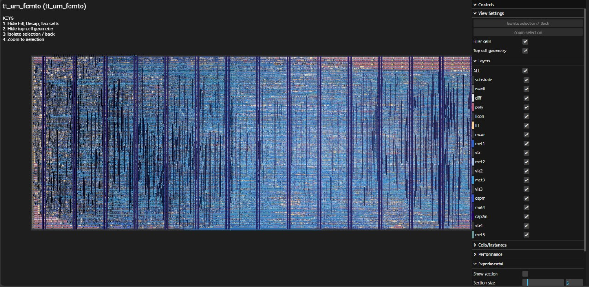
*Layout físico del procesador FemtoRV generado con Tiny TypeOut visto desde GDS Viewer. Se observan las celdas estándar, interconexiones y estructura del chip.*

---

### 5.6. SPICE Simulation & Analysis / Simulación y Análisis SPICE para Multiplicador de 4 Bits

Para esta sección, se realizó el ejercicio de simulación con un chip de menor complejidad debido al tamaño y complejidad del FemtoRV. Por lo tanto, se aplicó el mismo proceso anterior, pero utilizando un **multiplicador de 4 bits**. A continuación, se presentan los resultados, el uso del Makefile y los programas de conversión de archivos.

**De aquí en adelante, nos ubicaremos en la carpeta `mult_4_ASIC_Flow/`**, que contiene las subcarpetas `sim/` y `spice/`.

---

#### 5.6.1. Generación del Layout y Extracción SPICE

Al igual que con el FemtoRV, el archivo `.gds` del multiplicador de 4 bits se obtuvo mediante el template de **Tiny Tapeout** y el flujo automatizado de GitHub Actions.

**Repositorio del proyecto:**  
🔗 [https://github.com/EstebanUnal-Hub/TT_Mult_4](https://github.com/EstebanUnal-Hub/TT_Mult_4)

Tras descargar los artefactos generados, se procedió a cargar el layout en **Magic VLSI** para realizar la extracción del netlist SPICE con parásitos.

**Layout físico del multiplicador de 4 bits:**

  
*Layout del Multiplicador de 4 bits realizado con Magic VLSI. Se utilizaron comandos de extracción para generar el archivo `.spice` con parásitos.*

**Proceso de extracción en Magic:**

```bash
magic -T /home/linux/.volare/sky130A/libs.tech/magic/sky130A.tech tt_um_mult_4.gds
```

Dentro de la consola de Magic:

```tcl
extract all
ext2spice lvs
ext2spice cthresh infinite
ext2spice rthresh infinite
ext2spice
```

Esto genera el archivo `tt_um_mult_4.spice`, que contiene el netlist con las capacitancias e inductancias parásitas extraídas del layout físico.

---

#### 5.6.2. Visualización del Layout en Tiny Tapeout Viewer

Adicionalmente, el layout del multiplicador se puede visualizar en línea utilizando el **GDS Viewer** de Tiny Tapeout:

🔗 [https://gds-viewer.tinytapeout.com/](https://gds-viewer.tinytapeout.com/)

**Vista del chip en el Viewer:**

  
*Layout físico del chip multiplicador de 4 bits visto desde el GDS Viewer de Tiny Tapeout. Se observan las celdas estándar, interconexiones y la estructura completa del chip.*

---

#### 5.6.3. Simulación Funcional con GTKWave

Antes de realizar la simulación post-layout con Xyce, se verificó el comportamiento funcional del multiplicador mediante simulación RTL con **Icarus Verilog** y visualización en **GTKWave**.

**Señales de simulación funcional:**

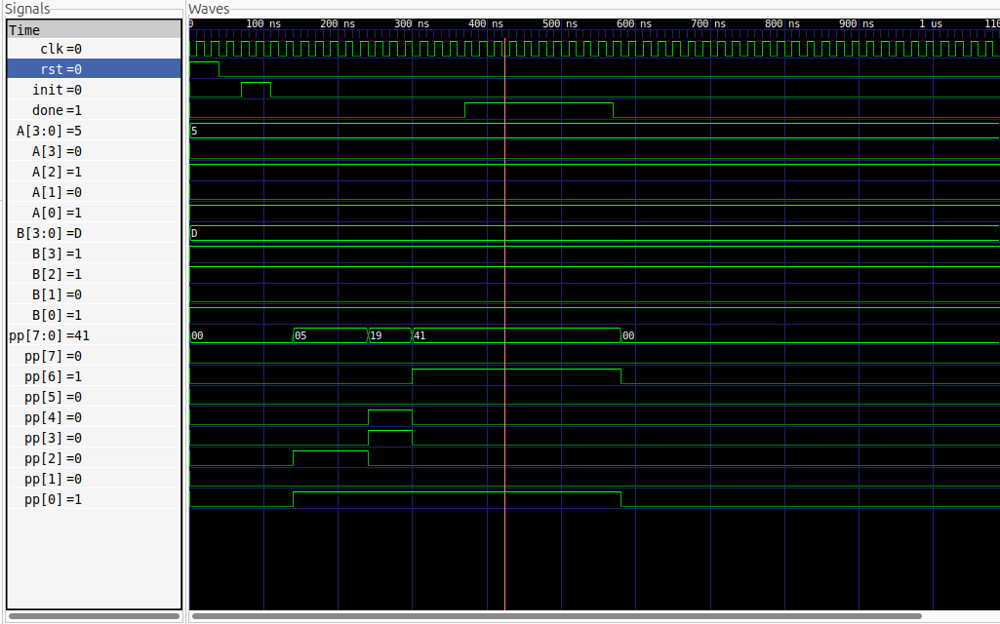  
*Simulación funcional del multiplicador de 4 bits. Se observan las señales de entrada (operandos A y B), reloj, reset y las señales de salida del producto parcial (PP).*

Durante la simulación funcional se verificó que:
- ✅ El multiplicador recibe correctamente los operandos de entrada
- ✅ Las señales de control (clk, reset) operan adecuadamente
- ✅ El resultado de la multiplicación es correcto
- ✅ Las señales de salida se generan sin errores

Al finalizar la simulación, se exportaron las señales de interés en formato `.tim` desde GTKWave para su posterior uso en la simulación SPICE:

```
File → Export → Write TIM File As → tt_um_mult_4.tim
```

---

#### 5.6.4. Conversión de Estímulos y Simulación con Xyce

**Ubicación:** `mult_4_ASIC_Flow/spice/`

Una vez extraído el netlist SPICE post-layout y generado el archivo `.tim` con los estímulos, se procedió a la conversión y simulación utilizando **Xyce**.

**Archivos Python de conversión:**

| Archivo | Descripción |
|---------|-------------|
| `tim_to_cir.py` | Convierte el archivo `.tim` a formato `.cir` con estímulos PWL |
| `plot_mult.py` | Genera gráficas de análisis de resultados |

**Automatización con Makefile:**

```makefile
########################################################################################################
##########     !!!!  IMPORTANTE     !!!!!                                                          #####
#             XYCE NO SOPORTA LEVEL 3                                                              #####
# Se debe modificar el archivo:                                                                       #
# /usr/local/share/pdk/sky130A/libs.ref/sky130_fd_pr/spice/sky130_fd_pr__diode_pw2nd_05v5.model.spice #
# colocando un comentario en la línea:                                                                #
# *+ level = 3.0                                                                                      #
########################################################################################################

TARGET=mult_4
TOP=mult_4
NPROC=4

all: tim_to_pwl xyce_tim plot

xyce_tim:
	mpirun -np ${NPROC} Xyce tt_um_${TARGET}.cir

extract:
	magic -T /home/linux/.volare/sky130A/libs.tech/magic/sky130A.tech tt_um_${TARGET}.gds

tim_to_pwl:
	python tim_to_cir.py tt_um_${TARGET}.tim

plot:
	python plot_mult.py 

clean:
	rm -rf *.out *.vcd *.svg *.json *.raw *.cir
```

**Ejecución del flujo completo:**

```bash
cd mult_4_ASIC_Flow/spice/

# 1. Convertir estímulos TIM a formato CIR con PWL
make tim_to_pwl

# 2. Ejecutar simulación paralela con Xyce (4 procesadores)
make xyce_tim

# 3. Generar gráficas de análisis
make plot
```

**Detalles de la conversión:**

El script `tim_to_cir.py` lee el archivo `tt_um_mult_4.tim` exportado desde GTKWave y genera un archivo `tt_um_mult_4.cir` que incluye:
- El netlist SPICE extraído del layout
- Estímulos PWL (Piecewise Linear) para las señales de entrada
- Configuración de análisis transitorio
- Directivas de salida para análisis posterior

---

#### 5.6.5. Visualización y Análisis de Resultados

Una vez completada la simulación con Xyce, se ejecuta el script de Python para generar las gráficas de análisis:

```bash
python plot_mult.py
```

Este script genera **tres gráficas principales** que verifican el correcto funcionamiento del multiplicador post-layout:

---

**1. Gráfica de Operandos (Operands):**

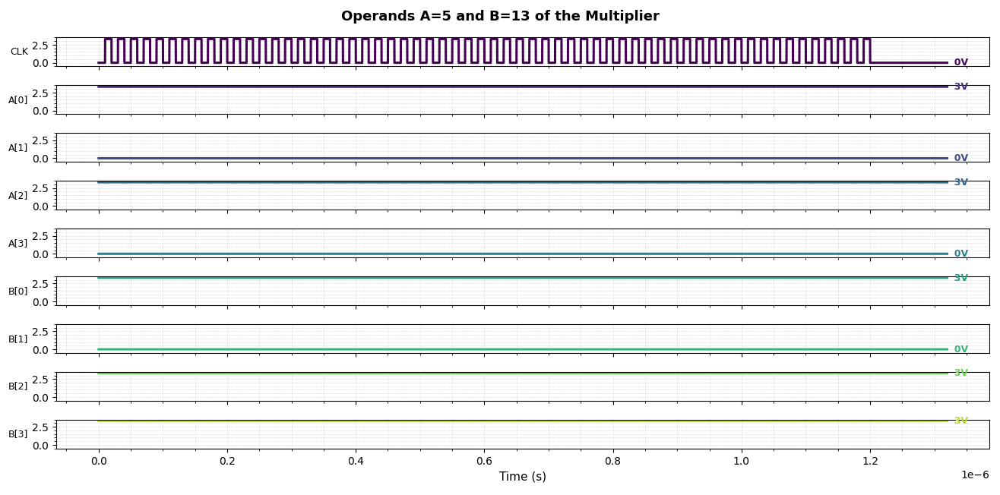  
*Señales de entrada del multiplicador. Se muestran los operandos de la multiplicación:*
- **Operando A = 5** (binario: `0101`), representado en las señales `A[0]`, `A[1]`, `A[2]`, `A[3]` (siendo `A[0]` el bit menos significativo)
- **Operando B = 13** (binario: `1101`), representado en las señales `B[0]`, `B[1]`, `B[2]`, `B[3]`
- **Resultado esperado: 5 × 13 = 65**

---

**2. Gráfica de Señales de Control y Salida (Signals):**

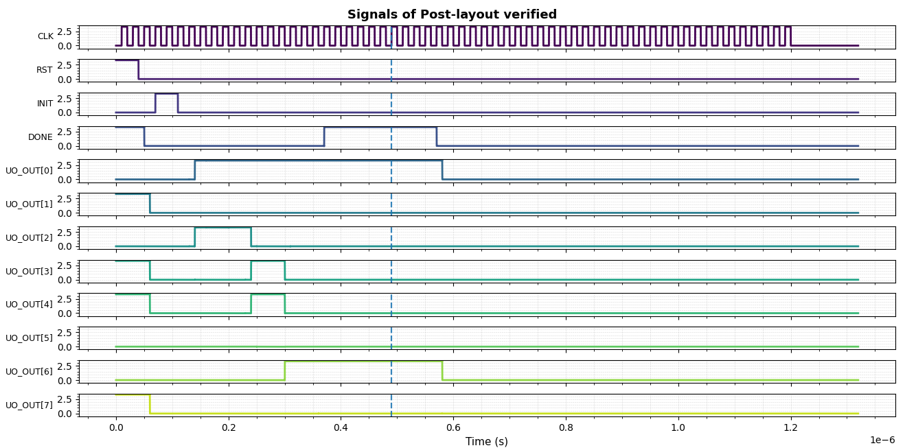  
*Señales de control y resultado del multiplicador:*
- **CLK:** Señal de reloj del sistema
- **Reset:** Señal de reinicio
- **Out_out (PP):** Señal de salida correspondiente al Producto Parcial (Partial Product) de 8 bits
- **Resultado observado:** `01000001` (binario) = **65** (decimal) ✅

Esta gráfica confirma que:
- ✅ El reloj opera correctamente
- ✅ El reset funciona apropiadamente
- ✅ El resultado de la multiplicación (PP) es correcto: 5 × 13 = 65

---

**3. Gráfica del Producto Parcial en Entero (MultResultPP):**

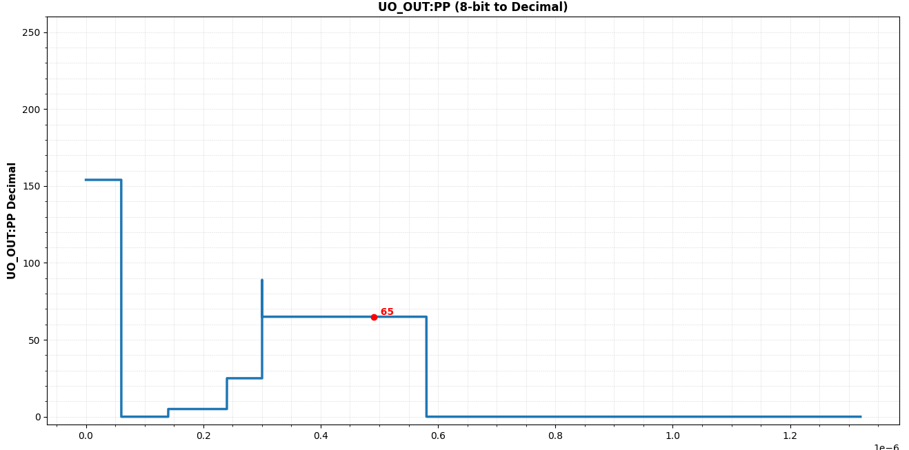  
*Comportamiento del Producto Parcial (PP) en formato entero a lo largo del tiempo.*

En esta gráfica se observa:
- La evolución temporal de la señal de salida PP
- Al finalizar el tiempo de ejecución (señal `Done`), el valor de PP es **65** (decimal)
- La estabilidad de la señal de salida tras la computación

---

#### 5.6.6. Conclusiones de la Simulación Post-Layout

Los resultados de la simulación SPICE post-layout demuestran que:

✅ **El chip del multiplicador responde adecuadamente a las señales de entrada** (operandos A = 5, B = 13)  
✅ **Las señales de salida funcionan correctamente**, generando el resultado esperado (PP = 65)  
✅ **Los parásitos extraídos del layout no afectan la funcionalidad** del diseño  
✅ **El timing del circuito es adecuado** para la frecuencia de operación configurada  
✅ **La integridad de las señales se mantiene** a través de las interconexiones físicas del chip

Estos resultados validan que el diseño del multiplicador de 4 bits está listo para fabricación, habiendo pasado exitosamente por todas las etapas del flujo ASIC, desde la simulación funcional RTL hasta la simulación post-layout con parásitos reales extraídos del GDSII.

---
## 6. Results & Verification / Resultados y Verificación

### 6.1. Métricas del Diseño

Tras completar el flujo RTL-to-GDSII, OpenLane genera reportes detallados sobre el diseño:

| Métrica | Valor |
|---------|-------|
| Área total | [TBD] µm² |
| Utilización | [TBD]% |
| Número de celdas | [TBD] |
| Frecuencia máxima | [TBD] MHz |
| Violaciones DRC | 0 |
| Violaciones LVS | 0 |

### 6.2. Verificaciones Completadas

✅ **Functional Verification:** Simulación RTL exitosa  
✅ **Logic Synthesis:** Netlist generado sin errores  
✅ **Physical Implementation:** GDSII generado  
✅ **DRC:** Sin violaciones de reglas de diseño  
✅ **LVS:** Layout coincide con netlist  
✅ **Post-Layout Extraction:** SPICE netlist extraído con parásitos  
✅ **SPICE Simulation:** Simulación post-layout con Xyce completada  
✅ **Signal Integrity Analysis:** Verificación de integridad de señales SPI

---

## 7. Next Steps / Próximos Pasos

- [ ] Optimización de frecuencia de reloj
- [ ] Simulaciones de corner cases (tt, ff, ss)
- [ ] Análisis de consumo de potencia (Power Analysis)
- [ ] Caracterización de delays con temperatura
- [ ] Preparación para tapeout final

---

## 8. References / Referencias

- [FemtoRV GitHub Repository](https://github.com/BrunoLevy/learn-fpga/tree/master/FemtoRV)
- [Tiny Tapeout Documentation](https://tinytapeout.com/docs)
- [OpenLane Documentation](https://openlane.readthedocs.io)
- [SkyWater PDK Documentation](https://skywater-pdk.readthedocs.io)
- [Magic VLSI Layout Tool](http://opencircuitdesign.com/magic/)
- [Xyce Parallel Electronic Simulator](https://xyce.sandia.gov/)
- [PySpice Documentation](https://pypi.org/project/ltspice/)
- [Repositorio original: Introduction to ASIC Flow](https://github.com/KanishR1/Introduction-to-ASIC-Flow)
- [Pagina Web YOSYS](https://yosyshq.net/yosys/)
- [Github Icarus verilog](https://steveicarus.github.io/iverilog/)
- [Github OPENSTA](https://github.com/The-OpenROAD-Project/OpenSTA)
- [Pagina Web GTKWAVE](https://gtkwave.sourceforge.net/)
- [Github OpenLane](https://github.com/The-OpenROAD-Project/OpenLane)
- [Pagina Ngspice](https://ngspice.sourceforge.io/)
- [Github OpenPDK](https://github.com/RTimothyEdwards/open_pdks)

---

## License / Licencia

Este proyecto se distribuye bajo [especificar licencia].

---

**Maintainers:** [Tu nombre/equipo]  
**Contact:** [email de contacto]